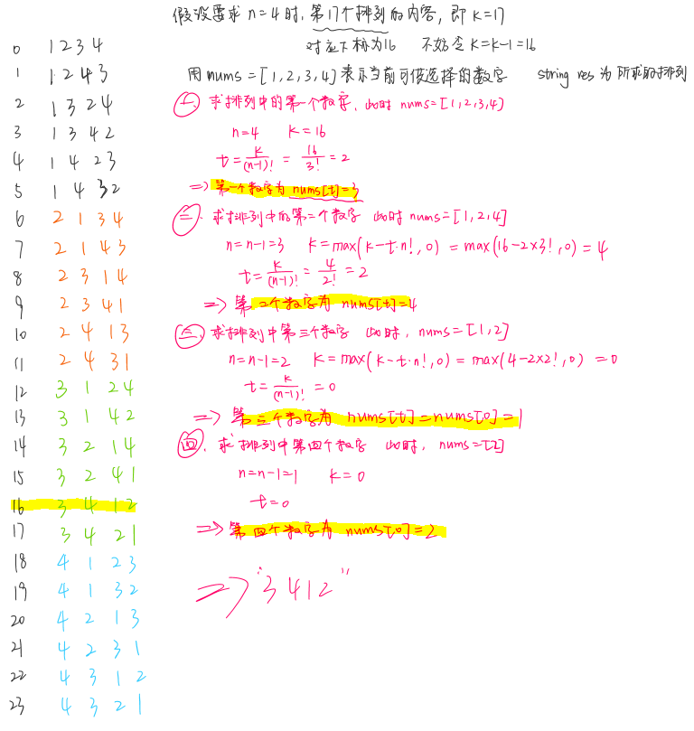

[TOC]

# Shuati

找工作刷题集合

## 205. 字符串同构【哈希】

**题意**

判断两个字符串是否具有相同的结构。

例如， 给定“egg”，“add”，返回真。 给定“foo”，“bar”，返回假。 给定“paper”，“title”，返回真。 

假设字符s和t具有相同的长度。

**解法**

* 思路一

将字符串转化成数字序列.
"egg" --> [0, 1, 1]
"paper" --> [0, 1, 0, 2, 3]
上面这个过程可以借助哈希表来实现，然后判断字符串s和t生成的矩阵序列是否相等。

* 思路2

简单粗暴上代码：

```cpp
class Solution {
public:
    bool isIsomorphic(string s, string t) {
        int m1[256] = {0}, m2[256] = {0}, n = s.size();
        for (int i = 0; i < n; ++i) {
            if (m1[s[i]] != m2[t[i]]) return false;
            m1[s[i]] = i + 1;
            m2[t[i]] = i + 1;
        }
        return true;
    }
};
```

## 242. 字符串变位词的判断【哈希】

**题意**

输入两个字符串s和t，t是不是s的一个变位次。

比如说：s="anagram", t="nagaram", 是；s="rat", t="car", 不是

假定字符串中只有小写字母。

**解法**

* 思路一

将s和t各自内部排序后判断是否相等。

* 思路二

分别为s和t构建哈希表，判断两个哈希表是否相等。

* 思路三

先为s构建哈希表，然后在为t构建哈希表的过程中，是对键值进行-1操作。所以整个过程中只需要一个哈希表，最后判断哈希表中是不是所有元素都为0。

## 290. 单词模式串【哈希】

**题意**

给出一个模式`patter`和一个字符串`str`，判断该字符串是否是该模式。

```
Input: pattern = "abba", str = "dog cat cat dog"
Output: true
```

```
Input:pattern = "abba", str = "dog cat cat fish"
Output: false
```

```
Input: pattern = "abba", str = "dog dog dog dog"
Output: false
```

**解法**

* 思路一

使用双映射关系。同时遍历pattern的每个字符和str中的每个word，建立他们之间的映射关系，当出现违背映射关系的情况时，可以直接返回false。`map<string, char> s`和`map<char, string> p `

* 思路二(没写代码)

对于pattern和str，分别用一个数字记录每个字符或word第一次出现的位置。当同时遍历pattern和str时，如果发现它们在某一位置的字符或word第一次出现的位置不同，则返回false。

* 思路三(简洁代码，还没看懂)

```cpp
bool wordPattern(string pattern, string str){
        unordered_map<char, int> p2i;
        unordered_map<string, int> s2i;
        istringstream in(str);
        string word;
        int i;
        for(i=0; in>>word; i++){
            if(i==pattern.size() || p2i[pattern[i]] != s2i[word]) return false;
            p2i[pattern[i]] = s2i[word] = i+1;
        }
        return i==pattern.size();
    }
```

## 349. 数组的交集【哈希】

**题意**

输入两个数组nums1和nums2，输出它们的交集元素。

**解法**

* 思路一

首先为第一个数组建立哈希表，然后遍历第二个数组中的元素，如果该元素在哈希表中存在且键值大于0，则将该元素放入交集中且将它的键值改为-1（为了保证当集合元素不唯一时，不会重复计算交集）。

* 思路二【set】

其实本质上和思路一差不多。首先，构造用nums1构造一个set，然后遍历nums2，如果能在set中找到当前元素，则将该元素放到要返回的vector中，并且在set中删除该元素。

* 思路三【set_intersection】

用STL里面的`set_intersection(s1.begin(), s1.end(), s2.begin(), s2.end(), inserter(res, res.begin())`，返回的是set。

## 350. 数组的交集 2【哈希】

**题意**

前一题(349)中，返回的数组交集元素只能出现1次。而本题中，如果某个元素同时在两个数组中出现的话，那么在交集中，它出现的次数也应该尽可能多。

对于 Input: nums1 = [1,2,2,1], nums2 = [2,2]

本题 Output: [2,2]      349题 Output: [2]

**解法**

* 思路一

和前一题的思路一基本一致，但是：首先为第一个数组建立哈希表，然后遍历第二个数组中的元素，如果该元素在哈希表中存在且键值大于0，则将该元素放入交集中且将它的键值-1。

* 思路二

```cpp
vector<int> intersect(vector<int>& a, vector<int>& b) {
    sort(a.begin(), a.end());
    sort(b.begin(), b.end());
    a.erase(set_intersection(a.begin(), a.end(), b.begin(), b.end(), a.begin()), a.end());
    return a;
}
```

## 387. 字符串中第一个非重复字符【哈希】

**题意**

输入一个字符串，判断第一个只出现过一次的字符的下标。如果不存在这样的字符，则返回-2。

```
s = "leetcode"
return 0.

s = "loveleetcode",
return 2.
```

假设字符串中只包含小写字母。

**解法**

* 思路一

用数组来建立哈希表。键值是每个字符出现的次数。然后遍历字符中每个字符，比对哈希表中的键值，如果等于1的话，则输出当前下标。最后跳出了遍历循环的话，就返回1，说明没有满足要求的字符。（能用数组建立哈希表的话就尽量用数组，因为map更耗时）。时间复杂度O(n)

* 思路二

用`unordered_map<int, pair<int, int>> mp;`来遍历字符串中的字符建立哈希，pair中的2个int分别代表当前key出现的次数，和第一次出现的位置。然后遍历生成的哈希表，找出仅出现一次且最先出现的字符的位置。

## 389. 找字符串的差异【哈希】

**题意**

输入两个字符串s和t，t中的字符是s中字符的乱序，且另外在随机位置随机添加了一个字符。要求输出这个被添加的字符。字符串由小写字母组成。

**解法**

* 思路一

首先为s构建哈希表`int mp[256]={0}`，键值表示的是该字符在s中出现的次数。然后遍历字符串t，如果当前字符没有在哈希表中出现(`mp[ch]==0`)，则返回该字符。否则的话`mp[ch]--`，因为新增的字符可能在s中曾出现多次。比如`s="ab",t="aab" `.

* 思路二

现对s中所有字符求和(ASCII求和)，然后对t中的所有字符求和，它们的差就是那个新添的字符。

* 思路三【位运算】

```cpp
class Solution {
public:
    char findTheDifference(string s, string t) {
        char r=0;
        for(char c:s) r ^=c;
        for(char c:t) r ^=c;
        return r;
    }
};
```

## 409. 最长回文串【哈希】

**题意**

输入一个由小写或大写字母组成的字符串，输出由这些字符组成的最长回文串的长度。

**解法**

对于原来每个字符串中的每个字符，如果该字符个数为偶数，则可以全部用来构建回文串，如果该字符个数为奇数，则该数量减去一个，用来构建回文串。最后加入一个奇数字符来构成回文串。

```
Input:
"abbbccccdd"

Output:
9(bbbccccdd或abbccccdd)
```

* 思路一

先为字符串构建哈希表，用sum=0表示回文串的初始长度。然后遍历哈希表，如果值是偶数，则把该值加入到sum，如果是奇数，则把该值-1加入到sum中。最后，如果出现过奇数的话，返回sum+1，否则返回sum。

## 438. 字符串中所有的变位词【哈希、滑动窗口】

**题意**

输入一个字符串s和一个非空的字符串p，在s中找出所有p的变位词(anagram)的起始下标。

字符串p的变位词（anagram）指的是字符长度和内容和p一样但内部字符顺序不一样的字符串。比如说"abc", 
"bca", "cba"都是“acb”的谜。

```
Input:
s: "cbaebabacd" p: "abc"
Output:
[0, 6]
Explanation:
The substring with start index = 0 is "cba", which is an anagram of "abc".
The substring with start index = 6 is "bac", which is an anagram of "abc".

Input:
s: "abab" p: "ab"
Output:
[0, 1, 2]
Explanation:
The substring with start index = 0 is "ab", which is an anagram of "ab".
The substring with start index = 1 is "ba", which is an anagram of "ab".
The substring with start index = 2 is "ab", which is an anagram of "ab".
```

**解法**

* 思路一

算是暴力的解法吧。时间复杂度是O(n^2)。先构建p的哈希表。然后用大小等于p的滑动窗口在s上滑动，对每个窗口内的子字符串，对照哈希表，如果该窗口内各个字符的相应个数和p的相同，则说明该窗口内的子字符串是p的变位词。

* 思路二

在思路一上进行改进，用两个哈希表，分别记录p中字符个数，和s中前p.size()个字串的字符个数，然后对这两个哈希表进行比较，如果相同的话，则将下标0放入结果res中。然后遍历s中剩余的字符，每次右边新加入一个字符，然后去掉左边的一个旧的字符，每次再比较两个哈希表是否相同即可。

* 思路三（还不懂）

[别人的解法](https://www.cnblogs.com/grandyang/p/6014408.html)

## 447. Boomerangs的数量【哈希】

**题意**

输入平面内n个点的坐标，boomerangs指的是一组点(i, j, k)满足，i到j的距离等于i到k的距离。返回所有这样的boomerangs的个数。n<=500，点的坐标范围是[-10000, 10000]。

```
Input:
[[0,0],[1,0],[2,0]]

Output:
2

Explanation:
The two boomerangs are [[1,0],[0,0],[2,0]] and [[1,0],[2,0],[0,0]]
```

**解法**

* 思路一

暴力法，时间复杂度是O(n^3)

* 思路二

先遍历每一个点，假设以该点作为i点，计算，其它所有点到该点的距离，如果有某个距离处的点有n(n>=2)个，则可以构成$n(n-1)$种对。时间复杂度O(n^2)

## 463. 岛屿的周长【暴力】

**题意**

输入一个二维的0-1矩阵表示地图，矩阵中每个元素表示一个cell。cell等于1代表陆地，0代表有水。岛屿由这些标记为1的cell组成，cell之间可以水平或者竖直连接，不能对角连接。岛屿完全由水环绕，且恰好只有一个岛屿。

假设岛屿中没有湖(也就是说并不存在为0的cell被1包围)，cell的边长都为1。矩阵的长和宽都不超过100。要求求出岛屿的周长。

**解法**

* 思路一

暴力法，时间复杂度O(n^2)。根据题意，可以先给原矩阵的周围加上一圈0生成一个新的矩阵。初始化sum=0，遍历这个新的矩阵，当遇到1时，判断其上、下、左、右四个位置的元素中0的个数，用sum对个数进行累加，最后返回sum。

## 500. 键盘行【哈希】

**题意**

输入一个由string组成的数组，输出所有满足要求的string。要求是：该string中每个字符都在键盘的同一行。

**解法**

* 思路一

直接哈希，将键盘中的字母分别映射到它们对应的行。然后遍历每个string，判断其中是否所有字符都在同一行。

## 575. 分发糖果【哈希】

**题意**

输入一个长度为偶数的整数数组，数组中不同的数字代表不同种类的糖果。每个数字代表一个该种类的糖果。你需要将这些糖果数量均等地分给弟弟和妹妹。求妹妹可以拿到的糖果种类数的最大值。

输入数组的长度是[2, 10000]且是整数。糖果的类别编号在[-100000, 100000]之间。

```
Input: candies = [1,1,2,2,3,3]
Output: 3
Input: candies = [1,1,2,3]
Output: 2
```

**解法**

* 思路一

糖果总数就是数组的大小n，因为妹妹能够分得一半的糖果，那么为了让妹妹分得的糖果总类别数更多，可以先每种糖果给妹妹分一个，这个过程中如果妹妹拿到的糖果数达到了n/2，那么返回n/2。如果妹妹每种类别都拿到了，但是还不够总数还不够n/2的话，这时妹妹的糖果总数就是她能拿到的最多类别数。这个过程中可以为糖果类别建立哈希表，分别存储每个类别的糖果总数。整个过程简述为，构建哈希表，然后遍历哈希表，时间复杂度为O(n)。

* 思路二

思路一中的时间复杂度虽然是O(n)，但是，实际上进行了两次for循环。可以在这个基础上改以下，在构建哈希表的过程中，如果当前键是新键，则给妹妹分配糖果，不是新键的话，正常建立哈希表，不用分糖果。这样就可以把两个for循环简化为一个了。

## 594. 最长的和谐子串【哈希】

**题意**

和谐子串的定义为：该数组中，最大值和最小值的差刚好为1。输入一个整数数组，找出所有字串中，最长的和谐子串的长度。输入数组的长度不超过20000.

```
Input: [1,3,2,2,5,2,3,7]
Output: 5
Explanation: The longest harmonious subsequence is [3,2,2,2,3].
```

**解法**

* 思路一

首先，要搞清楚这个子串的意思。子串中的元素不一定在原数组中是相邻的，但是它们之间相应的顺序应该和原来是一样的。

和谐子串要求其中的元素最大值和最小值相差为1。可以先给原数组用map(会自动排序)建立哈希表。然后遍历哈希表，如果相邻元素key值相差为1的话，则这两个元素可以构建和谐子串，长度为两个键值的和。比较这个长度和max_length的大小。在这个过程中不断更新max_length。

* 思路二

直接用unordered_map构建哈希表也是一样可以的。两次循环。

```cpp
    int findLHS(vector<int>& nums) {
        unordered_map<int,int>m;
        for(auto i: nums)
            m[i]++;
        int res = 0;
        for(auto it:m)
            if(m.count(it.first-1)>0) // 注意这里只需要判断比当前数小1的数就行了，不然的话会重复计数
                res = max(res, it.second+m[it.first-1]);
        return res;
    }
```

* 思路二

在构建哈希表的同时进行统计。只需要一次循环。

```cpp
    int findLHS(vector<int>& nums) {
        unordered_map<int,int>m;
        int res = 0;
        for(auto i: nums){
            m[i]++;
            if(m.count(i+1))
                res = max(res, m[i] + m[i+1]);
            if(m.count(i-1))
                res = max(res, m[i] + m[i-1]);
        }
        return res;        
    }
```
## 599. 两个列表的最小下标和【哈希】

**题意**

有两个元素类型为string的数组，分别表示Andy和Doris最喜爱的餐厅列表，她俩想要选一个餐厅就餐。要求找出这样一个餐厅，满足：A和D都喜欢，且在两个数组中的下标和是最小的。

注意，满足条件的餐厅可能有多个。

**解法**

* 思路一

先为其中一个数组构建好哈希表，键值是元素所在位置的下标。然后在为另一个数组构建哈希表的过程中判断当前元素是否在之前的数组中出现过，是的话，更新下标和的最小值min_length。然后随便遍历一个数组，判断元素是否在两个数组中都出现且键值之和等于min_length，加入结果容器中。

## 645. 集合中的错误【哈希】

**题意**

集合s最初包含1-n的中的所有整数，现在其中有一个元素重复了，且有一个元素消失了，找出这个重复元素和消失的元素。集合内元素是无序的。

**解法**

* 思路一

构建哈希表的过程中，同时统计所有元素的和sum，如果判断到某个元素出现了两次，该元素即为重复元素dup。另一个消失的元素是`n*(n+1)/2-sum+dup`。

* 思路二（位运算）

参见[discuss区](https://leetcode.com/problems/set-mismatch/discuss/105513/XOR-one-pass)

## 705. 设计哈希集合【哈希】

**题意**

设计一个哈希集合结构，不使用语言的内置哈希库函数。所有值的范围是[0, 1000000].

**解法**

* 思路一

用vector<int>，然后每次需要操作数据得时候先用find()贩毒案该数据是否存在。

* 思路二

用bool a[i]=true/false判断i是否在哈希表内，初始化a得大小为1000001。相比解法一，该解法是用空间换时间

## 706. 设计哈希表【哈希】

**题意**

设计一个哈希表结构，不允许使用内置的哈希表相关函数。所有键和值的范围都是是[0, 1000000].

**解法**

* 思路一

直接使用int a[1000001]来建立哈希表，初始化所有的值为-1.

## 720. 字典中最长的单词

**题意**

给一个由字符串单词组成的列表代表一个英文字典words，从其中找出长度最长的单词，该单词能由字典总其它的词组成。如果有多个可能的答案，返回字典序(a,b,c...)最小的那个单词。

**解法**


## 141. 判断链表是否含环【链表】

**题意**

判断一个链表是否含环。

**解法**

* 思路一

Floyd判圈算法，用两个指针，一个fast每次走两步，一个slow每次走一步，同时从链表头结点出发，如果某一时刻相遇了，则说明链表中含环，如果fast或fast->next为NULL，说明链表无环。

## 160. 链表的交点【链表】【哈希】

**题意**

找出两个单链表的交点。如下所示，返回指向c1的指针。没有交点则返回null， 要求时间复杂度是O(n)，空间复杂度是O(1)。

```
A:          a1 → a2
                   ↘
                     c1 → c2 → c3
                   ↗            
B:     b1 → b2 → b3
```

**解法**

* 思路一

时间O(m+n)，空间O(1)

先分别从headA和headB开始遍历链表，计算遍历的长度len1和len2。

如果len1>len2，则让headA先走len1-len2步。判断headA和heaB是否相等，相等的话直接返回headA。否则headA和headB同时走，每走一步判断是否相等，是的话返回相交节点。如果都走到了链表最后，则说明没有交点。

len2>len1时的做法相似。

len2=len1时，则直接headA和headB同时走就行了。

* 思路二

时间O(m+n)，空间O(n)或O(m)

可以考虑借助哈希表来实现。首先遍历headA，为每个指针(地址)建立哈希表，然后遍历headB中每一个指针，比对哈希表。

* 思路三

```cpp
ListNode *getIntersectionNode(ListNode *headA, ListNode *headB) {
    ListNode *cur1 = headA, *cur2 = headB;
    while(cur1 != cur2){
        cur1 = cur1?cur1->next:headB;
        cur2 = cur2?cur2->next:headA;
    }
    return cur1;
}
```

## 203. 移除链表中的元素

**题意**

移除链表中所有值为val的元素。

**解法**

* 思路一

直接遍历链表，判断。

## 206. 链表反转

**题意**

实现链表的反转。

**解法**

* 思路一

用三个指针实现。

* 思路二

用递归的方法实现，代码简洁，很值得深入理解和思考。

```cpp
class Solution{
public:
	ListNode* reverseList(ListNode* head){
		if(!head || !(head->next)) return head; //返回空。
		ListNode *node = reverseList(head->next);
		head->next->next = head;
		head->next = NULL;
		return node;
	}
};
```

## 234. 回文链表

**题意**

判断一个单链表是否为回文链表。

**解法**

* 思路一

将链表内容放到数组里，再进行回文串的判断。空间复杂度是O(n)。

* 思路二

用快慢指针的方法，遍历一遍原来的链表，当fast指向最后一个元素时，slow刚好指向后半段链表。对后半段链表进行反转，然后同时遍历两段链表进行比较。空间复杂度是O(1)，时间取决于反转链表算法。

## 237. 删除链表中的节点

**题意**

函数输入参数只有一个，那就是需要删除的链表节点，其它啥都没有。在原来的链表结构中删除该节点。

**解法**

* 思路一

如果该节点是链表的最后一个节点，只需要将该节点free就行了。

否则，将该节点下一个节点的值赋值给当前节点，然后删除下一个节点。

## 876. 链表的中点

**题意**

当链表节点个数为奇数个时，返回指向第(n+1)/2个节点的指针。

当链表节点个数为偶数个时，返回指向第n/2+1个节点的指针。

**解法**

* 思路一

快慢指针。

## 070. 爬楼梯【动态规划】3

**题意**

你正在爬一个n阶的楼梯，每次可以走一步或两步，问共有多少种走法可以到达楼梯最顶端。

**解法**

* 思路一

用f(n)表示到达第n阶楼梯时的走法数，可以很容易得到状态转移方程$f(n)=f(n-1)+f(n-2)$，特别地，$f(1)=1$，$f(2)=2$。

可以用递归来实现，但是递归太深的话会导致栈溢出。

* 思路二

在求f(5)得时候，我们要求f(3)和f(4)，且求f(3)和f(4)的时候，我们都需要f(1)和f(2)的值。

可以换个思路，从f(3)开始，把每个f(i)都存起来，以后就不需要计算了，直接找就行。

## 198. 房屋抢劫【动态规划】【贪心】

**题意**

你是一个专业的强盗，并且计划去抢劫某条街道上的店铺。当某两个相邻的店铺都被闯入时，会触发自动报警。

输入一个非负整数的数组，每个元素代表相应位置的店铺的财产。在不触发警报的前提下，求出你能抢到的最多的财产数量。

**解法**

* 思路一

感觉是一种贪心的思想，用f(i)表示，当第i个位置是最后一家店时，所能抢到的最多财产数量；nums[i]表示第i家店里的财产数量。贪心的思想就是，尽可能抱枕f(i)最大。$f(i)=max(f(i-1), f(i-2)+nums(i)$

## 303. 范围总和查询-不可变的【哈希】【动态规划】

**题意**

给一个整数数组，找出下标i和下标j之间的元素的总和。

```
Given nums = [-2, 0, 3, -5, 2, -1]

sumRange(0, 2) -> 1
sumRange(2, 5) -> -1
sumRange(0, 5) -> -3
```

注意：

可以认为数组是不变的；

会对sumRange()函数进行多次调用。

**解法**

* 思路一

```cpp
class NumArray {
public:
    NumArray(vector<int> nums) {
        
    }
    
    int sumRange(int i, int j) {
        
    }
};

/**
 * Your NumArray object will be instantiated and called as such:
 * NumArray obj = new NumArray(nums);
 * int param_1 = obj.sumRange(i,j);
 */
```

leetcode里面自带的IDE预先输入了上面的代码，不是刚开始不是很懂怎么出来了一个构造函数，然后就按初始思路下了下面的代码，就是直接用循环来计算下标i和j之间元素的总和。

```cpp
class NumArray {
public:
    vector<int> nums;
    NumArray(vector<int> nums) {
        this->nums = nums;
    }
    
    int sumRange(int i, int j) {
        if(i<0 || j>nums.size()-1) return 0;
        int sum=0;
        for(int k=i; k<=j; k++){
            sum += nums[k];
        }
        return sum;
    }
};
```

submit以后，居然beat 1.46%....醉了。

还是要好好理解题意QAQ

* 思路二

现在重新对问题分析，题目的意思大概是，会调用一次构造函数生成数组，然后在**一个测试用例中**会多次调用求和函数sumRange()。按照思路一，每次调用sunRange()都会进行O(n)的复杂度来求和，导致冗余计算。

为什么不在构造函数中添加哈希表构建。用f[n]记录前n个数的和，那么求nums[i]~nums[j]之间的和，可以用f[j]-f[i]来计算。

提交显示，beat 86.03%。

## 003. 最长无重复子串【哈希】【滑动窗口】

**题意**

输入一个字符，返回它的最长无重复子串的长度。

注意：最长子序列和最长子串的区别。

```
Input: "pwwkew"
Output: 3
Explanation: The answer is "wke", with the length of 3. 
             Note that the answer must be a substring, "pwke" is a subsequence and not a substring.
```

**解法**

* 思路一

先在草稿纸上想一想，如果是手工来找，要怎么找呢。比如说查找序列`abcadcabb`的最长无重复子串，从第一个字符串开始，往后看第二个字符b，`ab`是无重复的，再看c，`abc`也没有重复，接下来到字符a，`abca`中字符a重复了，然后目前的基字符串就编程了`bca`，接着看后面的字符...

上述做法抽象一下，其实就是用一个滑动窗口在字符串上进行滑动，用哈希表hash记录字符最后出现的位置，可以用left、right指针分别表示滑动窗口的两端，right不断向右扩张，每次判断hash[right]的值是否在滑动窗口中(也就是判断新的字符是否在当前子串中出现过)，如果是的话，改变left指针的值，`left=hash[right]+1`，在这个过程中滑动窗口的长度就是无重复子串长度，不断更新滑动窗口长度的最大值。

## 009. 回文数的判断

**题意**

判断一个整数是否为回文数。

```
Input: -121
Output: false
Explanation: From left to right, it reads -121. From right to left, it becomes 121-. Therefore it is not a palindrome.

Input: 10
Output: false
Explanation: Reads 01 from right to left. Therefore it is not a palindrome.
```

**解法**

* 思路一

根据题目给出的例子，首先可以知道，负数绝对不是满足要求的回文数。[0, 9]之间的整数肯定是回文数。

用取余、取整的方法，将整数各个位上的数字抽取出来放入一个数组中。用两个指针(一头一尾)，通向遍历数组，当发现对应两个位置的数字不相等时，则不是回文数，返回false。

时间复杂度和原来整数的位数n有关。O(n+n/2)

* 思路二

用取余的方法抽取各个位置上数字的过程中，首先取出来的是低位的数字，每一次取新数字的时候，把res（初始为0）*10，再加上这个新数字。最后判断得到的逆序数res和原数字是否相等。

时间复杂仍然和整数的位数n有关。O(n)

```cpp
class Solution {
public:
    bool isPalindrome(int x) {
        if(x<0) return false;
        if(x/10 == 0) return true;
        vector<int> tmp;
        int y=x, res=0;
        while(y){
            res = res*10 + y%10;
            y = y/10;
        }
        return res==x;
    }
};
```

* 思路三

思路二中，是等所有数字逆序完来比较结果的，其实可以在逆序一半的时候就进行判断，比如说判断`123321`是否是回文数，可以在对后面三位数进行逆序后，判断得到的`123`和剩下的`123`比较是否相等。

```cpp
class Solution {
public:
    bool isPalindrome(int x) {
        if(x<0|| (x!=0 &&x%10==0)) return false;
        int sum=0;
        while(x>sum)
        {
            sum = sum*10+x%10;
            x = x/10;
        }
        return (x==sum)||(x==sum/10);
    }
};
```

## 069. 求$[Math Processing Error]\sqrt{x}$的近似值【二分查找】

**题意**

输入x，返回$[Math Processing Error]\sqrt{x}$的近似值(如果是小数的话，返回整数部分)。不能调用库函数。

```
Input: 8
Output: 2
Explanation: The square root of 8 is 2.82842..., and since 
             the decimal part is truncated, 2 is returned.
```

**解法**

* 思路一

二分搜索。

## 278. 第一个糟糕的版本【二分查找】

**题意**

假设有n个版本 `[1, 2,..., n]`，假设其中第i个版本是bad version的话，那么i之后的版本都是bad version。题目给出了一个API`bool isBadVersion(version)`可用于判断版本是否为bad version。要求，返回第一个bad version(它前面的都是好的， 它以及其后都是bad)。

**解法**

* 思路一

暴力。从左往右遍历每个版本`isBadVersion()`的返回值，第一个返回的true的版本就是第一个糟糕的版本。

* 思路二

折半查找。

## 367. 合法的完美平方数【二分查找】

**题意**

输入一个正整数，如果该数可以写成某个整数的平方，那么返回true.

**解法**

* 解法一

折半查找。

## 374. 猜数更大或者更小【二分查找】

**题意**

猜数游戏：我随机挑选[1,n]范围内的一个数，你来猜。每次我会告诉你真实的结果比你猜的更大还是更小。

你可以调用预定义好的API`guess(int num)`，返回值是0/1/-1。

```
-1 : My number is lower
 1 : My number is higher
 0 : Congrats! You got it!
 
Input: n = 10, pick = 6
Output: 6
```

**解法**

* 思路一

折半查找。

## 441. 排列硬币

**题意**

有n个硬币，问能够堆成多少阶台阶(第一层台阶有一个硬币，第二层有2个...)。

n是一个非负整数，且在32位的有符号整数范围内。

```
n = 8

The coins can form the following rows:
¤
¤ ¤
¤ ¤ ¤
¤ ¤

Because the 4th row is incomplete, we return 3.
```

**解法**

* 思路一

暴力。

* 思路二

二分查找，小心溢出。

## 475. 加热器

**题意**

冬天来了！你的首要任务就是涉及一个标准加热器的固定制热半径，使得所有的房间都温暖。

现在，你知道所有房间和加热器的一维坐标位置，找出加热器的最小半径，使得所有房间都能被加热器覆盖。

输入两个一维矩阵，分别是房间和加热器的位置，输出加热器的最小半径。

注意：

1. 房间和加热器的数量都是非负的，并且不超过25000；
2. 房间和加热器的位置都是非负的，并且不超过$10^9$；
3. 只要某个房间在加热器的半径范围内，那该房间可以被温暖；
4. 所有的加热器都满足一个半径标准，且它们的制热半径是一样的。

```
Input: [1,2,3,4],[1,4]
Output: 1
Explanation: The two heater was placed in the position 1 and 4. We need to use radius 1 standard, then all the houses can be warmed.
```

**解法**

* 思路一

首先要把两个数组都按照从小到大的顺序排好序，我们的目的，就是希望houses中的每个元素都被cover。

遍历houses数组，对houses中每个元素，在heaters中找到能包含这个数字的左右范围，然后看左右两边谁近。如果某个house位置比heaters中的最小数字海啸，那么肯定用最小的heater去cover它，反之，如果比最大的数字还要大，那就用最大的heater去cover。对于每个house算出的半径，我们最后取其中的最大值。

通过上面的分析，可以写代码了。在heaters中两个数一组进行检查，如果后面一个数和当前house位置差的绝对值小于前面一个数和当前house位置差的绝对值，那么我们继续遍历下一组heater。跳出循环的条件是遍历到heater的最后一个数，或者上面的小于等式不成立，此时heater中的值和当前house位置的差的绝对值就是能cover当前house的最小半径。每次更新结果res。

```cpp
class Solution {
public:
    int findRadius(vector<int>& houses, vector<int>& heaters) {
        sort(houses.begin(), houses.end());
        sort(heaters.begin(), heaters.end());
        int n = heaters.size();
        int res = 0;
        for(int i=0; i<houses.size(); i++){// 遍历每个house
            int j=0;
            while(j<n-1 && abs(heaters[j]-houses[i])>=abs(heaters[j+1]-houses[i])) j++;
            res = max(res, abs(heaters[j]-houses[i]));
        }
        return res;
    }
};
```

## 056. 合并区间【排序】

**题意**

给出一串区间的集合，合并所有有交集的区间。

```
Input: [[1,3],[2,6],[8,10],[15,18]]
Output: [[1,6],[8,10],[15,18]]
Explanation: Since intervals [1,3] and [2,6] overlaps, merge them into [1,6].
```

**解法**

* 思路一

将这些区间，根据左端口的值进行从小到大来排序。

对于排序后的区间序列，假设有两个相邻区间值为`[s1, e1]和[s2, e2]`，这里s1 <= s2，可以划分成三种情况来考虑区间合并：

1. `e1<s2`，此时两个区间没有交集；
2. `e1==s2`，此时两个区间恰恰可以合并成`[s1, e2]`；
3. `s2<e1`，区间可以合并成`[min(s1,s2), max(e1,e2)]`.

## 005. 最长回文子串【动态规划】

**题意**

输入一个字符串，返回它的最长回文子串。

**解法**

* 思路一

动态规划就是要找到当前状态和子状态之间的关系。状态转移方程为$flag[i][j] = flag[i+1][j-1] \&\& s[i]==s[j]$.

## 007. 翻转整数【注意溢出问题】

**题意**

输入一个32位的有符号整数，输出翻转后的数。

```
Input: -123
Output: -321

Input: 120
Output: 21
```

**解法**

32位有符号整数的范围是$[-2^{31}, 2^{31}-1]$，整数翻转问题要特别注意溢出。int型数值范围是-2147483648~2147483647，当 x = 2140000009时，对x翻转，9000000412则会溢出。

http://www.cnblogs.com/grandyang/p/4125588.html

* 思路一

用long long 64位。

* 思路二

在每次*10之前判断。具体见代码。

## 006. ZigZag 转换【找规律】

**题意**

将一个字符串，按z字形每个字符展开，然后按行输出新的字符串。`numRows`表示展开的行数

```
Input: s = "PAYPALISHIRING", numRows = 4
Output: "PINALSIGYAHRPI" 
Explanation:

P     I    N
A   L S  I G
Y A   H R
P     I
```

**解法**

我一开始的思路是，推导出展开后的zigzag的列数col，然后遍历`numRows*col`大小的矩阵来将原来的字符填入矩阵中。其实这种做法非常麻烦。首先会浪费很多的空间，因为如果按z字形填入矩阵的话，实际是会有很多空的位置没有字符的。其次，如果按z字形填好了，再遍历矩阵取出这些字符也很耗时。

* 思路一

`vector<vector<char>> res(numRows)`，遍历字符串中的每个字符，依次将字符放入到其所属行的vector的末尾。注意numRows=0和1的情况。

* 思路二

在[discuss区](https://leetcode.com/problems/zigzag-conversion/discuss/3435/If-you-are-confused-with-zigzag-patterncome-and-see!)看到的.


```
/*n=numRows
Δ=2n-2    1---------[step1]-----------2n-1---------[step1]---------4n-3
Δ=        2                     2n-2  2n                    4n-4   4n-2
Δ=        3               2n-3        2n+1              4n-5       .
Δ=        .           .               .               .            .
Δ=        .       n+2                 .           3n               .
Δ=        n-1 n+1 ----[step2]------   3n-3    3n-1                 5n-5
Δ=2n-2    n                           3n-2                         5n-4
*/
```
先推导一下zigzag的规律如上。

```cpp
class Solution{
public:
	string convert(string  s, int numRows){
		string result = "";
		if(numRows==1) return s;
		int step1, step2;
		int len = s.size();
		for(int i=0; i<numRows; i++){
			step1 = (numRows-i-1)*2;
			step2 = i*2;
			int pos = i;
			if(pos < len) result += s.at(pos);
			while(1){
				pos += step1;
				if(pos >= len) break;
				if(step1) result += s.at(pos);
				
				pos += step2;
				if(pos >= len) break;
				if(step2) result += s.at(pos);
			}
		}
		return result;
	}
};
```

## 008. 字符串转整数【string】【数据类型溢出处理】

**题意**

`int atoi(const char *nptr)`是c语言中的把字符串转换成整型数的一个函数，该函数会扫描`ntpr`字符串，会跳过前面的空格字符，如果nptr不能转换成整数或者空字符串，那么将返回0。实现这个函数，要注意，如果整数的值超出32位有符号数的表示范围的话，返回`INT_MAX`(正数)，或者`INT_MIN`(负数)。

**解法**

* 思路一

直接遍历原来的字符串，从第一个不为空格的字符开始，'+'/'-'来确定整数的正负，到第一个不为数字的字符结束转换。

```cpp
 res = res*10 + (str[i]-'0');  //这句代码很容易导致数据溢出！
```

处理的方法是，在该句代码执行前加上以下代码：

```cpp
if(sign==1){// INT_MAX = 2147483647
	if(res>INT_MAX/10 || (res==INT_MAX/10 && str[i]>'7')) return INT_MAX; //正数越界
}
else{// INT_MAX = -2147483648
	if(res>INT_MAX/10 || (res==INT_MAX/10 && str[i]>'8')) return INT_MIN; //负数越界		
}
```

要特别注意上面这段代码，通用性很广，用于判断数据类型溢出。

* 思路二

用`long res`来暂存结果，还是照常运算，计算过程中比较res和INT_MAX，INT_MIN的大小，溢出的时候直接返回这两个临界值，否则直接返回正常转换的结果。

## 215. 无序数组中第k大的元素

**题意**

找出一个无序数组中，第k大的元素。注意这里指的是排序后的数组中，第k大的元素。

```
Input: [3,2,3,1,2,4,5,5,6] and k = 4
Output: 4
Input: [3,2,1,5,6,4] and k = 2
Output: 5
```

**解法**

* 思路一

用sort()将原来数组从小到大进行排序，然后下标k-1，也就是`nums[k-1]`就是要求的第k大的元素。

* 思路二

使用`nth_element()`函数，具体调用是`nth_element(nums.begin(), nums.begin()+k-1, nums.end(), cmp)`，该函数执行完后，`nums[k-1]`就是第k大的数。

* 思路三

借助快速排序思想，快速排序(从小到大)就是每次选取一个基准`pivot`，将不大于它的元素放到它的右边，将不小于它的元素放到它的左边，然后对左右两个子部分都进行上面的操作。我们要找第k大的元素，就是每次k-1是在这个基准的左边还是右边，如果是右边的话，对右边再进行处理；如果是左边的话，对左边再进行处理。如果刚好就是这个基准的话，不用再进行排序，直接返回就行了。

## 012. 整数转罗马数

**题意**

输入范围是[1, 3999]内的任意一个整数，输出它对应的罗马字符串。

对应的转换规则如下：

```
Symbol       Value
I             1
V             5
X             10
L             50
C             100
D             500
M             1000
```

特别地有6种情况：

- `I` can be placed before `V` (5) and `X` (10) to make 4 and 9. 
- `X` can be placed before `L` (50) and `C` (100) to make 40 and 90. 
- `C` can be placed before `D` (500) and `M`(1000) to make 400 and 900.

```
Input: 1994
Output: "MCMXCIV"
Explanation: M = 1000, CM = 900, XC = 90 and IV = 4.
```

**解法**

* 思路一

先**不考虑**特殊的那六种情况，相当于是，尽可能地用大的Symbol去代表原来的整数。

以1994为例子，num = 1994，先尝试用num去除以1000，如果得到的整数部分不为0的话，就说明生成的罗马串中，一定有M。此时res = "M"，然后用余数num - num/1000 = 994再继续试着去除以1000，发现整数部位是0，说明M已经够了，然后用994去整除500，整数部分不为0，所以给罗马串res加上"D".....

因为有6种特殊的情况，也就是说，之前是考虑整出M、D、....，现在变成了考虑M、CM、D、CD、....，都是一样的。Symbol和value之间的对应可以用map映射来完成。

* 思路二

总有一些神版本(这里直接粘贴的java，C++的类似)：

```
public static String intToRoman(int num) {
    String M[] = {"", "M", "MM", "MMM"};
    String C[] = {"", "C", "CC", "CCC", "CD", "D", "DC", "DCC", "DCCC", "CM"};
    String X[] = {"", "X", "XX", "XXX", "XL", "L", "LX", "LXX", "LXXX", "XC"};
    String I[] = {"", "I", "II", "III", "IV", "V", "VI", "VII", "VIII", "IX"};
    return M[num/1000] + C[(num%1000)/100] + X[(num%100)/10] + I[num%10];
}
```

绝！

## 013. 罗马数转整数

**题意**

和前面一题差不多，这里是逆过来，根据罗马串s，输出其对应的整数。

**解法**

* 思路一

我的思路还是很简单，就是跟012题一样，建立映射，然后根据从左到右，每次取出一个字符，判断该字符是单独出现还是需要跟其后的一个字符组合起来一起进行映射求值。将映射得到的值相加起来。

| Time Submitted    | Status                                                       | Runtime       | Language |
| ----------------- | ------------------------------------------------------------ | ------------- | -------- |
| a few seconds ago | [Accepted](https://leetcode.com/submissions/detail/198280362/) | 132 ms(2.85%) | cpp      |

运行时间需要132ms，程序不够简洁啊。

* 思路二

```
int romanToInt(string s) 
{
    unordered_map<char, int> T = { { 'I' , 1 },
                                   { 'V' , 5 },
                                   { 'X' , 10 },
                                   { 'L' , 50 },
                                   { 'C' , 100 },
                                   { 'D' , 500 },
                                   { 'M' , 1000 } };
                                   
   int sum = T[s.back()];
   for (int i = s.length() - 2; i >= 0; --i) 
   {
       if (T[s[i]] < T[s[i + 1]])
       {
           sum -= T[s[i]];
       }
       else
       {
           sum += T[s[i]];
       }
   }
   return sum;
}
```
## 014. 多个字符串的最长公共前缀

**题意**

找出一个由string组成的数组内，所有的string的最长公共前缀。

**解法**

* 思路一

假设s是前i个字符串的最长公共前缀，求s和第i+1个字符串$s_{i+1}$的最长公共前缀，若是""则直接返回，否则更新s的值。

* 思路二

还没有看discuss

## 015. 3sum

**题意**

属于k-sum类问题。找出数组中的三元组组合，使得它们的和为0。结果中不包含重复的情况。

**解法**

* 思路一

先将数组排序。在2sum的基础上再套一层循环。特别要注意处理重复值的情况。[-4 1 2 2 2 2 ]以该数组考虑，先找到了【-4 2 2】的组合，那么当head和tail指针移动的时候，要注意判断。具体见我代码的注释。

注意特殊的情况【-4 2 2 2 2】/ 【-4 1 1 2 2 3 3】

## 016. 3sum-closet

**题意**

k-sum类问题。输入一个数组和一个target，在三元组的和中，找出最接近target的那个。

**解法**

* 思路一

和前面015题类似，用一个变量distance来记录已经判断过的三元组中和target的差的绝对值的最小值，用变量res来记录相对应的最接近target的和，在循环过程中不断更新。

## 017. 电话号码的字母组合

**题意**

输入一个由[2， 9]中某些数字(整数)组成的字符串，返回所有可能的字符串组合。数字到字符之间的映射就像是九宫格数字键盘。注意0/1是不对应任何字符的。

```
Input: "23"
Output: ["ad", "ae", "af", "bd", "be", "bf", "cd", "ce", "cf"].
```

**解法**

* 思路一

其实一开始我是没有思路的，然后看了discuss区别人的代码，理解了再来写程序。

“递归的思想”

假设原始字符串中共有m个数字，已经求得了前n(n < m)个数字串对应的字符串组合序列，存储在vector向量res中。

为了有个直观的理解，假设原始字符串是"234"，现在已经求得了"23"对应的字符串组合为`str = ["ad", "ae", "af", "bd", "be", "bf", "cd", "ce", "cf"]`，现在要求"234"对应的字符串组合，"4"映射的字符是''ghi"。只要给str中每个字符串都加上"g"、”h“、”i“就行了。

## 018. 4sum

**题意**

在数组中找出所有的四元组集合，满足它们的和等于target。输出的集合中，不含有重复的元素。

**解法**

* 思路一

这一题还是属于k-sum类问题。在前面的3sum问题基础上，最外面再套层循环。

特别要注意。因为要求不能出现重复的情况，所以每次指针移动的时候，都要判断新位置的元素和前一个位置元素是否相同，如果相同的话则要跳过这个元素。

下面是截取出来的代码(不完整，这里仅作分析用)：

```cpp
while(nums[head]==nums[head-1] && head+1<=tail) head++; // 注意1  这里的<=  是为了防止[3 3 3 3]  如果第1/4个3满足情况(head=第一个3， tail=第4个3)，那么使用<号的话 会把第2/3个3也算作一种情况
while(nums[tail]==nums[tail+1] && tail-1>=head) tail--; // 注意2 同上

while(nums[three]==nums[three-1] && three+1<n) three++; // 注意3  这里是<n   而不是<n-2
while(nums[four]==nums[four-1] && four+1<n) four++; // 注意4 这里是<n  而不是<n-2
```

## 019. 移除链表倒数第n个节点

**题意**

移除链表倒数第n个节点，返回新链表得头节点。

**解法**

* 思路一

如何确定第n个节点得位置？---用两个指针，其中一个先走n-1步，然后两个同时走。当第一个指针走到最后一个节点时，第2个指针刚好是指向倒数第n个节点的。

要注意的是：

* 特殊情况1：删除刚好的第一个节点
* 特殊情况2：原链表只有一个节点，删除倒数第一个节点后应该返回一个空指针
* 一般情况，要删除倒数第n个节点，要让slow指针指向倒数第n-1个节点，然后`slow->next = slow->next->next`

## 020. 括号匹配

**题意**

输入一个由`'('`, `')'`, `'{'`, `'}'`, `'['` and `']'`, 组成的字符串，判断是否是合法的。

**解法**

* 思路一

利用堆栈。

1. 前括号直接入栈
2. 后括号需要判断栈顶是否是相应的前括号，是的话，出栈。否则返回false
3. 循环结束如果栈非空则返回false

## 022. 生成所有的合法括号串

**题意**

给你n对括号，写一个函数来生成所有能正确配对的括号串。

假设n=3，则输出：

```
[
  "((()))",
  "(()())",
  "(())()",
  "()(())",
  "()()()"
]
```

**解法**

**一般涉及到要列出所有结果的题，考虑用递归来求解。**

* 思路一【递归】

字符串只有左括号和右括号两种字符，而且最终结果必定包含n个左括号和右括号。
**“子问题思想”：**

假设目前已经排好的字符串是`str`【str中肯定是左括号>=右括号】，剩下left个左括号和right个右括号：
(1) left > right  ------无法继续下去

(2) left==right==0  ------ 已经完成了一次完整的构造；

(3) left==right   ------可以尝试str+‘(’ 或 str+')'，记得对相应的left或right做减一操作；

(4) left < right   ------如果left是大于 0的，同样可以尝试str+‘(’ 或 str+')'；如果left等于0的，只能尝试str+')'，因为没有了左括号用于尝试。

上述过程用递归实现。具体见代码。

## 024. 成对交换链表中的节点

**题意**

给一个链表，交换链表的相邻两个节点，返回头节点。

```
Given 1->2->3->4, you should return the list as 2->1->4->3.
```

要求空间复杂度是常数，不能修改链表节点的值，只能对指针进行操作。

**解法**

* 思路一

先处理特殊的情况，也就是空链表和只有一个节点的情况。

然后使用三个指针操作。

* 思路二

递归实现。

```cpp
class Solution {
public:
    ListNode* swapPairs(ListNode* head) {
        if(head==NULL || head->next==NULL) return head;
        ListNode *a=head, *b=head->next;
        head = b;
        a->next = b->next;
        b->next = a;
        a->next = swapPairs(a->next);
        return head;   
    }
};
```

## 061. 旋转链表【递归/链表/2个指针】

**题意**

对给定的链表进行k次旋转。1次旋转是指，把当前链表的最后一个节点放在链表头的位置来。

```
Input: 0->1->2->NULL, k = 4
Output: 2->0->1->NULL
Explanation:
rotate 1 steps to the right: 2->0->1->NULL
rotate 2 steps to the right: 1->2->0->NULL
rotate 3 steps to the right: 0->1->2->NULL
rotate 4 steps to the right: 2->0->1->NULL
```

**解法**

* 思路一

每次旋转必须找到当前链表的最后一个节点，并且把它放在链表头来。【用2个指针来实现】

这个旋转的操作是由规律的，假设链表的长度为`len`，每经过`len`次旋转得到的链表应该是和原始链表一样的。所以可以先求出链表的长度`len`，然后对链表进行`k%len`次旋转就行了【递归实现】。

## 031. 下一个排列【记住！】

**题意**

c++中的`bool nex_permutation(start, end)`函数其作用是，当当前序列存在下一个排列时，返回true，不存在则返回false。这里的排列指的是，字典序/大小的排列。“12345”的下一个排列是"12354"(所有比12345大的数排列中，最小的那个)。“54321”不存在下一个排列，因为它是所有排列中最大的那个数。

本题是要求实现一个函数，求某个数字序列的下一个排列数，如果不存在的话，输出最小的那个排列数。

**解法**

光是理解题意就理解了很久。

1. 【错误思路1】
   刚开始的思路是，以`15247`为例，从最右边开始向前找，找到第一个小于7的数是4，然后得到下一个排列数是`15274`。然后开始写代码，run，果断报错。

2. 【错误思路2】
   对于`15342`，应该是找到比2小的数字1后，交换1和2得到`25341`，然后将2后面的数字从小到大排列得到`21345`，看起来完美啊！但是！答案还是错的！实际上正确的是`15423`!!

3. 【正确解法】
   后来看了discuss，大神的思路真的好清奇啊QAQ我是怎么也想不出来这样的解法。。。
   可以参照下面的动图。从右往左，找到第一个减小的数在位置i，然后从该数往右看，找到离它最远的但是比它大的数，交换这两个数的位置，然后将位置i后面的序列从小到大重新排列。

   

## 060. 排列序列

**题意**

集合`[1, 2, 3, ..., n]`总共包含`n!`个不同的排列方式。当`n=3`时，通过按顺序将其所有排列进行编号可以得到：

   1. `"123"`
   2. `"132"`
   3. `"213"`
   4. `"231"`
   5. `"312"`
   6. `"321"`

输入n和k，返回第k个排列序列。

   ```
   Input: n = 3, k = 3
   Output: "213"
   ```

**解法**

* 思路一   

直接调用c++ STL的`next_permutation()`函数。

* 思路二

类似于找规律



## 100. 判断两棵二叉树是否一样

**题意**

输入参数是指向两棵树根节点的指针，如果两棵树的结构以及对应节点的值都是一样的，返回true，否则返回false.

**解法**

* 思路一

  递归实现

## 204. 统计素数个数

**题意**
统计所有小于n的整数中，素数的个数。

**解法**

* 思路一

  遍历每一个数，依次判断是否为素数。会超时。

* 思路二【厄拉多塞筛法】

  

  将2~n中各个数存入表中，标记2为素数，然后将所有小于等于n的2的倍数(不包括2本身)标记为非负数；

  找到下一个未被标记的数是3，将它标记为素数，然后将所有小于等于n的3的倍数(不包括3本身)标记为非负数； 

  重复上述过程直至所有的数都被标记完。

## 029. 位操作实现整除

**题意**

给你两个整数`dividend`和`divisor`，不能使用乘法、除法和取余操作。返回$\frac{dividend}{divisor}$的整数取值。

注意：

  1. 除数不可能是0；
  2. 注意int的范围是$[-2^{32}, 2^{32}-1]$，当结果越界，返回$2^{32}-1$；

**解法**

  这个题目一开始是没有思路，是看了讨论区的代码然后理解了自己来写的。

* 思路一【简单粗暴】

  最简单的思路是使用减法来实现，假设两个数都是正数，只要被除数是大于除数的，让被除数不断地减去除数，直到差值小于0。统计总共减了多少次。这种方法的时间复杂度可能偏高。

* 思路一【位操作】

  假设是要求20除以3的整数部分，

  > 初始时，被除数是20，除数是3，依次将除数扩大为2倍（3左移一位）、四倍（3左移2位）。。。用被除数-除数：
  >
  > 20-3>0，20-6>0，20-12>0，~~20-24<0~~-; **1<<2=4**

  >取20-12=8为被除数，3为除数，重复类似上面的步骤：
  >
  >8-3>0，8-6>0，~~8-12<0~~；**1<<1=2**

  > 取8-6=2为被除数，3为除数，重复：
  >
  > ~~2-3<0~~； **0**

  综上,`4+2+0=6`，所以20除以3的整数部分取值是6.

  还有一个问题就是，当越界的时候，需要返回INT_MAX，可以用long类型来运算，然后直接返回，越界的话，会自动转换为INT_MAX返回。

## 088. 合并2个有序数组

**题意**

将2个有序数字`nums1`和`nums2`合并成一个。假设`nums1`有足够的空间来存储合并后的数组。

**解法**

用两个指针同时从数组nums1和nums2的最后一个元素开始比较，较大的数放在nums1数组的末尾，然后指针前挪一位，继续比较。

## 102. 二叉树层序遍历

**题意**

输出二叉树的层序遍历结果（一个二维的数组）。

```
      3
     / \
    9  20
      /  \
     15   7
```

对该树进行层序遍历，输出：

```
  [
    [3],
    [9,20],
    [15,7]
  ]
```

**解法**

对二叉树进行层序遍历，相对于是从根节点开始，对二叉树进行广度优先遍历。

但是这里要求是对每一层的结点值要放在一个数组中，每一层的数组合起来组成需要返回的一个二维数组。

如果只是简单的BFS话，并不需要也没有考虑结点层级问题。

回顾一下BFS的步骤，首先是将根节点放到队列中；每次取出队列首结点，然后将该结点的左儿子和右儿子放入队列中；重复这个步骤直到队列为空。

## 094. 二叉树中序遍历

**题意**

中序遍历二叉树，将遍历结果保存在数组中。

**解法**

* 思路一

  递归。

* 思路二

  非递归(堆栈)。

## 098. 二叉排序树是否合法

**题意**

判断一棵树是否为二叉排序树(BST).

**解法**

* 思路一

  如果一棵树是二叉排序树，那么根节点的数值必须大于其左子树上所有结点的数值（即大于左子树最大结点值），且小于其右子树上所有结点的数值（即小于右子树最小结点值）。

  根据这个规则，递归判断。

* 思路二

  BST一个特点就是，对其中序遍历得到的结果一定是有序的（递增）。

  所以可以对BST进行中序遍历，如果遍历到某个结点时发现其小于等于前一个结点，那么可以判定一定不是BST。

  可以对BST非递归中序遍历来进行修改，实现。

  暂时还不知道如何修改递归中序遍历来实现。

## 104. 求二叉树的最大深度

**题意**

返回一棵二叉树的最大深度。

**解法**

* 思路一

  二叉树的最大深度 = max(左子树的最大深度, 右子树的最大深度) + 1

  递归实现

* 思路二

  对树进行广度优先遍历的过程中记录树的深度。

## 096. 不同的二叉排序树【DP】

**题意**

求出整数1~n这n个树可以构建多少种不同形态的二叉排序树。

```
Input: 3
Output: 5
Explanation:
Given n = 3, there are a total of 5 unique BST's:

   1         3     3      2      1
    \       /     /      / \      \
     3     2     1      1   3      2
    /     /       \                 \
   2     1         2                 3
```

**解法**

* 思路一【动态规划】

  用**F[i]**表示i个整数可构建的不同形态二叉排序树棵树。对于n个数1~n：
  当n是最后一个加入到已经建好的BST中，那么此时可产生**F[n-1]\*1**棵不同的BST;
  当n是第1个加入到已经建好的BST中，那么此时可生成**1\*F[n-1]**棵不同的BST;
  当n是第i个加入到已经建好的BST中，那么此时可生成**F[i-1]\*F[n-i]**棵不同的BST;
  通过上面分析可以得到，$F[n] = 1*F[n-1] + F[1]*F[n-2] + F[2]*F[n-3] + ... + F[n-1]*1$，为了边长方便，可以令F[0]=1，即：
  $F[n] = F[0]*F[n-1] + F[1]*F[n-2] + F[2]*F[n-3] + ... + F[n-1]*F[0]$

## 033. 在旋转数组中进行查找【logN，二分】

**题意**

假设有一个在某个点被旋转了的升序数组(比如说`[0,1,2,4,5,6,7]` 旋转后变成 `[4,5,6,7,0,1,2]` )，要求在O(logN)的时间复杂度内返回target的下标，如果未找到，则返回-1。

```
Input: nums = [4,5,6,7,0,1,2], target = 0
Output: 4
```

**解法**

* 思路一【分治法+二分查找】

初始化偏置`offset = 0`，一开始的思路时，在原数组中进行二分，`mid = (start+end)/2，`判断中间位置元素`nums[mid]==target`是否成立，是的话直接就返回`offset = offset + mid`即为target的下标。如果不成立的话：

1. nums左半部分有序(`nums[start]<nums[mid]`)，且target在左半部分(`target>=nums[start] && target<=nums[end]`):

   ​	在左半部分left进行二分查找，如果没找到target，则返回-1。如果能找到target，则返回`offset+此时target相对left首位的偏置`；

2. nums右半部分有序(`nums[mid]<nums[end]`)，且target在右半部分(`target>=nums[mid] && target<=nums[end]`):

   ​	在右半部分right进行二分查找，如果没找到target，则返回-1。如果能找到target，则返回`offset+左半部分的长度+此时target相对right首位的偏置`；

3. nums左半部分有序(`nums[start]<nums[mid]`)，但target不在左半部分：

   ​	offset置为`offset+左半部分的长度`；对nums的右半部分重复上述操作。

4. nums右半部分有序，但target不在右半部分：

   ​	offset不变，对nums的左半部分重复上述操作。

这是自己最初的思路，实现起来还是一直出bug，最后调出来程序的效率是4ms，beat 100%。后来看了讨论区还是有更简单的实现方法。

